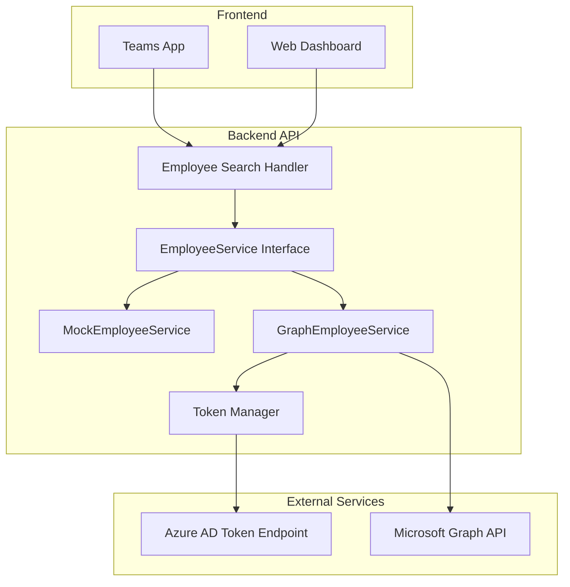
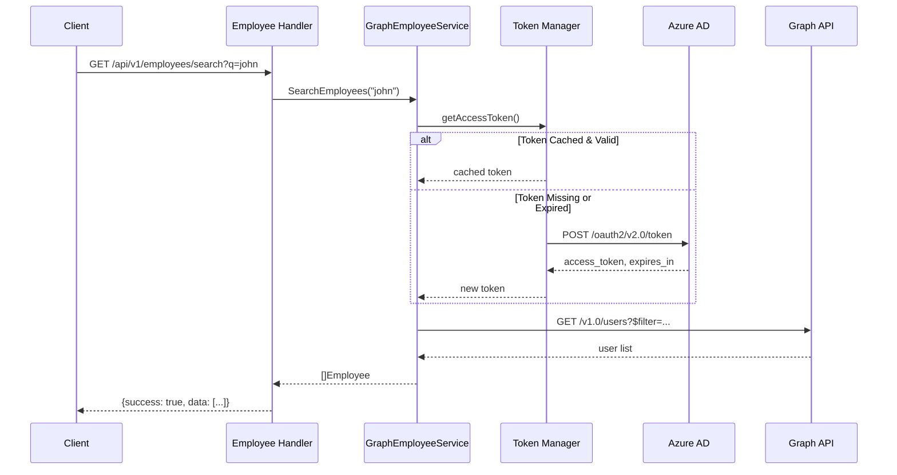

# Design Document: Teams Employee Search

## Overview

本设计文档描述如何将 Teams 员工搜索接口从 Mock 实现替换为 Microsoft Graph API 实现。设计重点包括：

1. **OAuth2 Token 管理** - 实现 Client Credentials 流程的 token 获取和缓存
2. **Graph API 集成** - 使用 Microsoft Graph API 搜索和验证员工
3. **服务切换机制** - 支持开发环境使用 Mock，生产环境使用 Graph API

现有的 `GraphEmployeeService` 已有基础框架，本设计将完善其实现并增强错误处理。

## Architecture



### 请求流程



## Components and Interfaces

### 1. EmployeeService Interface (已存在)

```go
// 位置: src/backend/internal/services/card_service.go
type EmployeeService interface {
    ValidateEmployees(employeeIDs []string) (bool, error)
    SearchEmployees(query string) ([]models.Employee, error)
}
```

### 2. GraphEmployeeService (增强实现)

```go
// 位置: src/backend/internal/services/employee_service.go
type GraphEmployeeService struct {
    tenantID     string
    clientID     string
    clientSecret string
    httpClient   *http.Client
    token        string
    tokenExpiry  time.Time
    mu           sync.RWMutex  // 新增: 保护 token 并发访问
}

// 构造函数
func NewGraphEmployeeService(tenantID, clientID, clientSecret string) EmployeeService

// Token 管理 (内部方法)
func (s *GraphEmployeeService) getAccessToken() (string, error)

// 接口实现
func (s *GraphEmployeeService) ValidateEmployees(employeeIDs []string) (bool, error)
func (s *GraphEmployeeService) SearchEmployees(query string) ([]models.Employee, error)
```

### 3. 服务工厂函数

```go
// 位置: src/backend/internal/services/employee_service.go
func NewEmployeeService(config *Config) EmployeeService {
    if config.AzureTenantID != "" && 
       config.AzureClientID != "" && 
       config.AzureClientSecret != "" {
        log.Println("Using GraphEmployeeService with Microsoft Graph API")
        return NewGraphEmployeeService(
            config.AzureTenantID,
            config.AzureClientID,
            config.AzureClientSecret,
        )
    }
    log.Println("Using MockEmployeeService (Azure credentials not configured)")
    return NewMockEmployeeService("")
}
```

## Data Models

### Employee Model (已存在)

```go
// 位置: src/backend/internal/models/employee.go
type Employee struct {
    ID         string  // 主键，使用 Azure AD Object ID
    AADID      string  // Azure AD Object ID，用于 @mentions
    Name       string  // 显示名称
    Email      string  // 邮箱地址
    Department string  // 部门
}
```

### Graph API Response Mapping

| Graph API Field | Employee Field | 说明 |
|-----------------|----------------|------|
| id | ID, AADID | Azure AD Object ID |
| displayName | Name | 用户显示名称 |
| mail | Email | 用户邮箱 |
| department | Department | 部门名称 |

### Token Response Structure

```go
type tokenResponse struct {
    AccessToken string `json:"access_token"`
    ExpiresIn   int    `json:"expires_in"`  // 秒数
    TokenType   string `json:"token_type"`  // "Bearer"
}
```

### Graph Users Response Structure

```go
type graphUsersResponse struct {
    Value []struct {
        ID          string `json:"id"`
        DisplayName string `json:"displayName"`
        Mail        string `json:"mail"`
        Department  string `json:"department"`
    } `json:"value"`
}
```


## Correctness Properties

*A property is a characteristic or behavior that should hold true across all valid executions of a system—essentially, a formal statement about what the system should do. Properties serve as the bridge between human-readable specifications and machine-verifiable correctness guarantees.*

Based on the prework analysis, the following correctness properties have been identified:

### Property 1: Token Caching Returns Cached Token

*For any* GraphEmployeeService with a valid cached token that has not expired, calling getAccessToken() should return the cached token without making any HTTP request.

**Validates: Requirements 1.3**

### Property 2: Token Proactive Refresh Near Expiry

*For any* GraphEmployeeService with a cached token that expires within 60 seconds, calling getAccessToken() should trigger a new token request and return a fresh token.

**Validates: Requirements 1.4**

### Property 3: Token Error Contains Status and Message

*For any* failed token request with a specific HTTP status code and error body, the returned error should contain both the status code and the error message.

**Validates: Requirements 1.5**

### Property 4: Search URL Construction

*For any* non-empty search query string, the Graph API request URL should:
- Use the endpoint `https://graph.microsoft.com/v1.0/users`
- Include a `$filter` parameter with `startswith(displayName, '{query}') or startswith(mail, '{query}')`
- Include a `$select` parameter with `id,displayName,mail,department,jobTitle`

**Validates: Requirements 2.1, 2.2, 2.3**

### Property 5: Graph Response Mapping

*For any* valid Graph API users response, the mapping to Employee objects should correctly map:
- `id` → `ID` and `AADID`
- `displayName` → `Name`
- `mail` → `Email`
- `department` → `Department`

**Validates: Requirements 2.4**

### Property 6: Search Error Propagation

*For any* Graph API search request that fails with an HTTP error, the SearchEmployees function should return an error containing the failure reason.

**Validates: Requirements 2.6**

### Property 7: Validation Correctness

*For any* set of employee IDs:
- If all IDs exist in Azure AD (200 responses), ValidateEmployees should return (true, nil)
- If any ID does not exist (404 response), ValidateEmployees should return (false, nil)

**Validates: Requirements 3.2, 3.3**

### Property 8: Validation Error Handling

*For any* validation request that fails due to network or authentication errors (non-404 failures), ValidateEmployees should return an error.

**Validates: Requirements 3.4**

### Property 9: Service Selection Based on Configuration

*For any* configuration:
- If AZURE_TENANT_ID, AZURE_CLIENT_ID, and AZURE_CLIENT_SECRET are all non-empty, NewEmployeeService should return a GraphEmployeeService
- If any of these values is empty, NewEmployeeService should return a MockEmployeeService

**Validates: Requirements 5.1, 5.2**

## Error Handling

### Token Acquisition Errors

| Error Type | HTTP Status | Handling |
|------------|-------------|----------|
| Invalid credentials | 401 | Log error (excluding secret), return error with message |
| Tenant not found | 400 | Log error, return error with tenant ID |
| Network timeout | N/A | Return error with timeout details |
| Rate limited | 429 | Log retry-after, return error |

### Graph API Errors

| Error Type | HTTP Status | Handling |
|------------|-------------|----------|
| Unauthorized | 401 | Clear cached token, retry once with new token |
| User not found | 404 | Return false for validation, empty for search |
| Bad request | 400 | Log filter query, return error |
| Rate limited | 429 | Log retry-after header, return error |
| Server error | 5xx | Log error, return error |

### Error Response Format

```go
// 搜索失败时返回
{
    "success": false,
    "error": {
        "code": "SEARCH_FAILED",
        "message": "Failed to search employees",
        "details": "Graph API returned status 401: Unauthorized"
    }
}
```

## Testing Strategy

### Unit Tests

Unit tests should cover specific examples and edge cases:

1. **Token Manager Tests**
   - Test token request with valid credentials
   - Test token caching behavior
   - Test token refresh timing
   - Test error handling for various HTTP status codes

2. **Search Function Tests**
   - Test URL construction with various query strings
   - Test response mapping with sample Graph API responses
   - Test empty query handling
   - Test special characters in query (URL encoding)

3. **Validation Function Tests**
   - Test with single valid ID
   - Test with multiple valid IDs
   - Test with invalid ID (404)
   - Test with mixed valid/invalid IDs

4. **Service Factory Tests**
   - Test with all credentials present
   - Test with missing tenant ID
   - Test with missing client ID
   - Test with missing client secret

### Property-Based Tests

Property-based tests should verify universal properties across many generated inputs. Use a Go property-based testing library such as `gopter` or `rapid`.

**Configuration**: Each property test should run minimum 100 iterations.

**Tag Format**: `Feature: teams-employee-search, Property {number}: {property_text}`

| Property | Test Description |
|----------|------------------|
| Property 1 | Generate random valid tokens with various expiry times > 60s, verify cached token is returned |
| Property 4 | Generate random non-empty query strings, verify URL contains correct filter and select |
| Property 5 | Generate random Graph API response structures, verify mapping produces correct Employee objects |
| Property 7 | Generate random sets of employee IDs with various 200/404 response combinations, verify validation result |
| Property 9 | Generate random configuration combinations, verify correct service type is returned |

### Integration Tests

Integration tests should verify end-to-end behavior with mocked external services:

1. **Full Search Flow** - Mock Graph API, verify complete request/response cycle
2. **Token Refresh Flow** - Mock token endpoint, verify refresh behavior
3. **Error Recovery** - Mock various error scenarios, verify graceful handling

### Test Dependencies

```go
// go.mod additions for testing
require (
    github.com/stretchr/testify v1.8.4  // assertions
    github.com/flyingmutant/rapid v1.1.0  // property-based testing
    github.com/jarcoal/httpmock v1.3.1  // HTTP mocking
)
```
